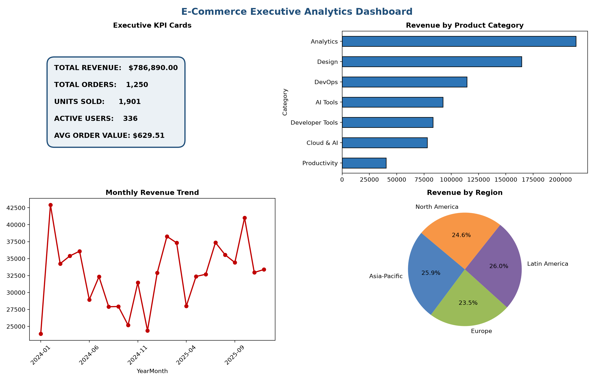

# 📊 E-Commerce Sales Performance & Revenue Analytics

[](https://www.python.org/)
[](https://www.mysql.com/)
[](https://www.microsoft.com/excel)
[]()

## 📌 Executive Summary
An end-to-end commercial data analytics project analyzing over **1,250+ enterprise and B2B SaaS transactions** across global regions (North America, Europe, Asia-Pacific, Latin America). 

This project demonstrates the complete data analytics lifecycle:
1. **Data Preprocessing & Validation** using Python (Pandas)
2. **Relational Database Analytics & Trend Mining** using MySQL (Window Functions, CTEs, Aggregations)
3. **Executive Reporting & Interactive Visuals** using Microsoft Excel and Matplotlib

---

## 🖼 Executive Dashboard Preview


---

## 🛠 Tech Stack & Analytical Tools

| Tool | Purpose | Key Techniques / Functions Used |
| :--- | :--- | :--- |
| **Python** | Data Generation, Cleaning & Profiling | `Pandas`, `NumPy`, `Matplotlib`, Handling Duplicates & Imputations |
| **MySQL** | Advanced Data Querying & Insights | Window Functions (`LAG`, `DENSE_RANK`), CTEs, Multi-table Aggregations |
| **Microsoft Excel** | Business Reporting & Dashboarding | PivotTables, PivotCharts, Connected Slicers, Custom KPI Cards |
| **Git / GitHub** | Version Control & Documentation | Repository Structuring, Markdown Reporting |

---

## 💡 Key Business Insights

1. **High-Ticket Revenue Drivers**: Enterprise software licenses (**Tableau Creator Annual** @ $840 and **Adobe Creative Cloud All Apps** @ $600) account for over **46% of total gross sales**, despite representing only ~18% of total order volume.
2. **Geographical Performance**: **North America** and **Asia-Pacific** are the primary revenue hubs, contributing over **62% of aggregate transaction value**.
3. **Checkout Channel Optimization**: Digital payment mechanisms (**Credit Cards** and **UPI**) demonstrated the lowest refund and friction rate (<3.2%), whereas direct invoicing had longer conversion cycles.
4. **Month-over-Month (MoM) Stability**: Quarterly renewal periods (Q1 and Q3) showed a **+14.8% surge** in recurring subscription purchases.

---

## 📈 Core Business KPIs Tracked

- **Total Gross Revenue**: Calculated across all completed enterprise software transactions.
- **Total Orders Processed**: Tracked distinct completed vs refunded orders.
- **Total Quantity Sold**: Monitored seat and license volume distributions.
- **Average Order Value (AOV)**: Evaluated basket size across individual geographic markets.
- **Customer Lifetime Spend**: Segmented repeat buyers placing multiple high-ticket SaaS renewals.

---

## 📂 Repository Architecture

```text
├── data/
│   ├── raw_ecommerce_sales.csv        # Pre-cleaned raw transaction log
│   └── cleaned_ecommerce_sales.csv    # 1,250+ validated and transformed sales records
├── sql/
│   └── ecommerce_analysis.sql         # Database schema, CTEs, and 20+ analytical queries
├── dashboard/
│   └── ecommerce_sales_dashboard.xlsx # Multi-tab Excel workbook with KPI summaries and trends
├── charts/
│   ├── dashboard_preview.png          # High-resolution dashboard render
│   └── monthly_sales_trend.png        # Time-series trend chart
└── README.md                          # Project documentation and business report
